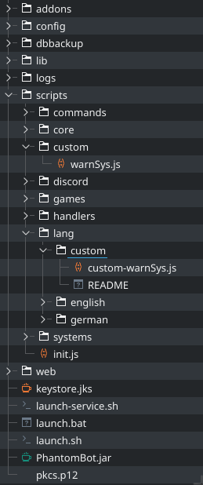

[]()
[]()
[]()

[](https://github.com/Lapotor/PhantomBot-WarnSys/blob/master/LICENSE.md)

# PhantomBot-WarnSys
This script let you warn viewers with PhantomBot

# Installation
To install this script you simply need to download the latest release (click on the image):

[](https://github.com/Lapotor/PhantomBot-WarnSys/release/latest)

[]()

and drop it in your PhantomBot folder `/path/to/phatombot`. Now restart the Bot and when you see this at the end of the startup the script is **active**:
[]()

# Usage
Its really simple!
First of all i need define two things:
```
  [] => Optional for command use
  () => Required for command use
```

### The warn command
```
!warn (User) [Reason]
```
With this command you increase the warn level of the given user add ban/timout the user with the given reason.

### Delete one warn
```
!delwarn (User)
```
With this command you decrease the warn level of the given user.

### Clear the warns
```
!delwarn (User) all
```
As it say it clear the warnings of the given User

# Support, Bug etc.
[](https://github.com/Lapotor/PhantomBot-WarnSys/issues)

If you found a bug please open a issue here or tell me in the PhantomBot Community.

---
[](LICENSE.md)

This work is licensed under the "Do **W**hat **T**he **F**uck You Want To **P**ublic **L**icense". To see the full License Text go to the [LICENSE File](LICENSE.md)
